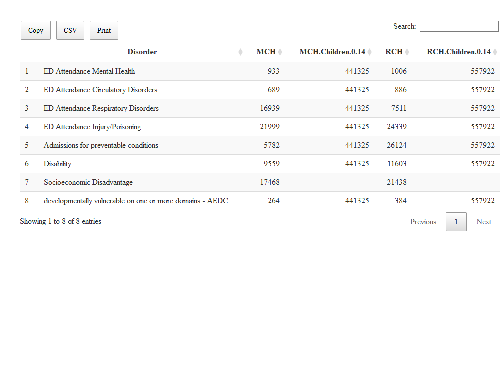
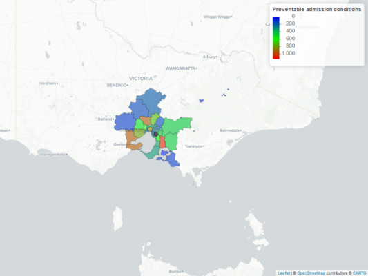
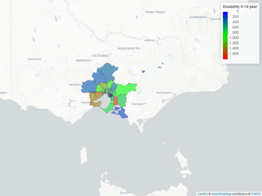
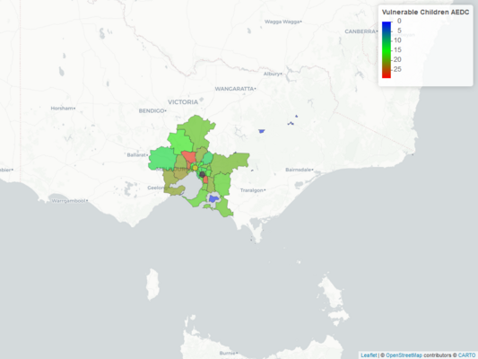
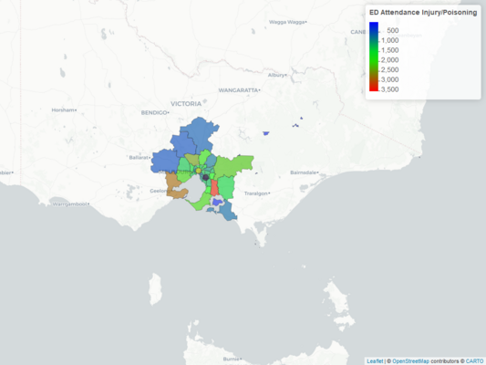

# Thematic Maps of common childhood (0-14) presentations to Emergency Department within catchment of Monash and Royal Children's Hospitals
This is a [thematic map](https://gntem2.github.io/MCHMap)  of the common childhood presentation to emergency departments (ED). The map is constrained to local government areas within 80 km of the two major children hospitals in Melbourne: Royal Children's Hospital and Monash Children's Hospital. The data comes from Torrens University Australia and can be accessed directly from their website. Data on Australian Early Development Census (AEDC) can also be downloaded from the AEDC website. The shapefiles for the local government areas are available from Australian Bureau of Statistics.

The catchment was created by determining which local government areas are within 80 km of the two major children hospitals. The zoom button (+/-) for the map is in the upper left hand corner. The viewer can also choose the base tile map by clicking on the layer control box, located below the zoom button. The data can also be downloaded directly from the screen by clicking the icons (Copy, CSV, Excel, Print, PDF). click here  

Children Hospital catchment within 80 km|ED Attendance Mental Health
---|---
[Click here for link to Web page](./ChildrenHospital.html)|[Click here for link to Web page](./MCH_Mental.html) 
ED Attendance Circulatory Diseases|ED Attendance Respiratory Disease
 [Click here for link to Web page](./MCH_Circ.html) |[Click here for link to Web page](./MCH_Resp.html) 
ED Attendance Preventable Diseases|ED Attendance Disability
[Click here for link to Web page](./MCH_PD.html)|[Click here for link to Web page](./MCH_disability.html) 
ED Attendance Vulnerable Children|ED Attendance Injury/Poisoning
[Click here for link to Web page](./MCH_AEDC.html) |[Click here for link to Web page](./MCH_injury.html) 

The term vulnerable refers to Children developmentally vulnerable on one or more domains. These children were assessed in their Australian Early Development Census (AEDC) first year at school. 
