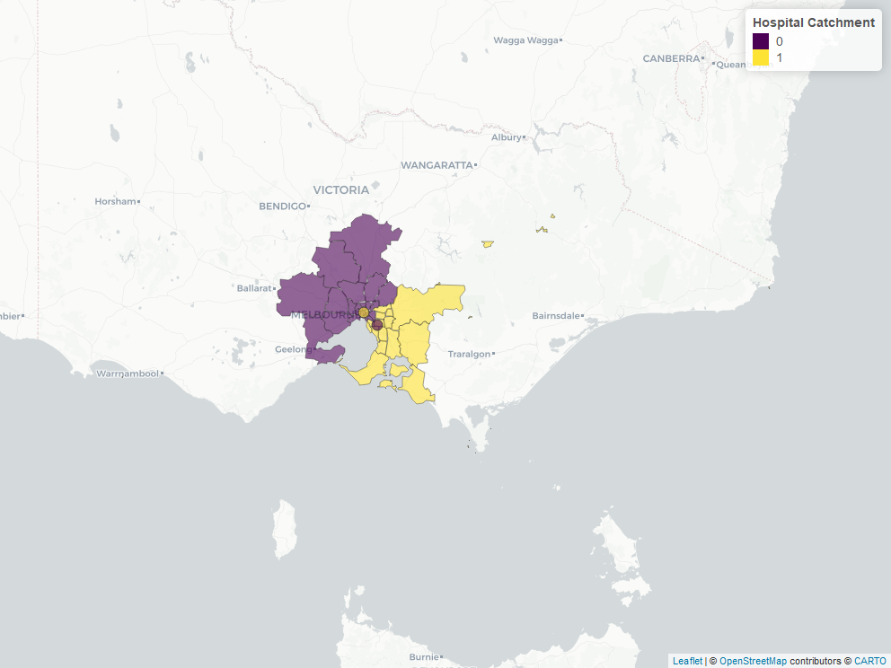
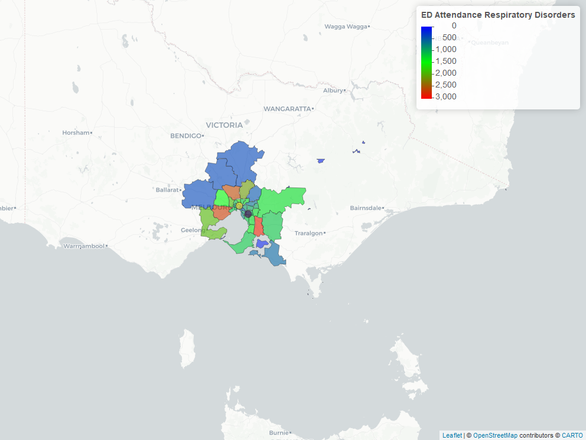
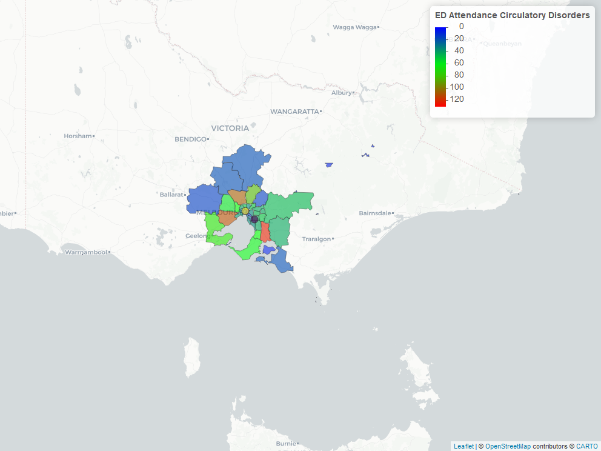

# Thematic Maps of common childhood presentation to Emergency Department
This is a [thematic map](https://gntem2.github.io/MCHMap)  of the common childhood presentation to emergency departments (ED). The map is constrained to local government areas within 80 km of the two major children hospitals in Melbourne: Royal Children's Hospital and Monash Children's Hospital. The data comes from Torrens University Australia and can be accessed directly from their website. Data on Australian Early Development Census (AEDC) can also be downloaded from the AEDC website. The shapefiles for the local government areas are available from Australian Bureau of Statistics.

The catchment was created by determining which local government areas are within 80 km of the two major children hospitals. .  The zoom button (+/-) is in the upper left hand corner. The viewer can also choose the base tile map by clicking on the layer control box, located below the zoom button. The  can also be downloaded directly from the screen by clicking the icons (Copy, CSV, Excel, Print, PDF).

ED attendance for mental health issues in children (age 0-14). The map is available below 

ED attendance for Respiratory disorders in children (age 0-14). The map is available below 

ED attendance for Circulatory disorders in children (age 0-14).The map is available below 

ED attendance for Injury/Poisoning in children (age 0-14).The map is available below 

Prevalence of Disability in children (age 0-14).The map is available below 

Prevalence of Vulnerable children (age 0-14). The term vulnerable refers to Children developmentally vulnerable on one or more domains. These children were assessed in their Australian Early Development Census (AEDC) first year at school. The map is available 
